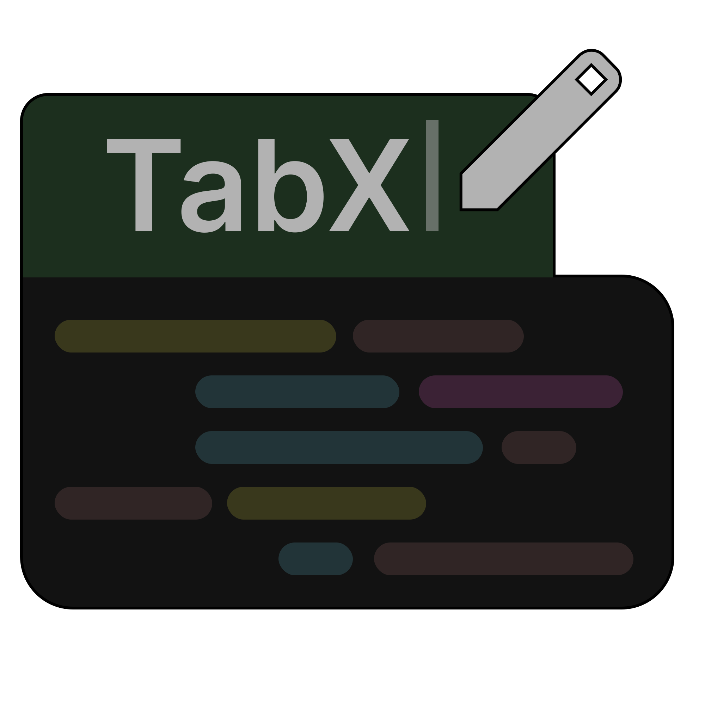

  
  <h1>TabX - JetBrains Plugin</h1>

**TabX** is a lightweight plugin for JetBrains IDEs that allows you to **rename editor tabs** for better organization and readability.

## Features

- Rename any editor tab in your JetBrains IDE.
- Two easy ways to rename tabs:
    - **Right-click context menu**: Select the tab you want to rename and choose the rename option.
    - **Keyboard shortcut**: Press `Shift + Alt + F2` to rename the currently active tab.
- Works across all JetBrains IDEs (IntelliJ IDEA, PyCharm, WebStorm, PhpStorm, etc.).

## Installation

1. Open your JetBrains IDE.
2. Go to `Settings` → `Plugins`.
3. Search for `TabX`.
4. Click `Install` and restart your IDE.

## Usage

1. **Using the Context Menu:**
    - Right-click on the editor tab you want to rename.
    - Select **Rename Tab**.
    - Enter your desired name and press `Enter` or click `Ok`.

2. **Using the Shortcut:**
    - Focus the tab you want to rename.
    - Press `Shift + Alt + F2`.
    - Enter the new name and press `Enter` or click `Ok`.

Organize your workspace the way you want with **TabX** — no more confusing tab names!
